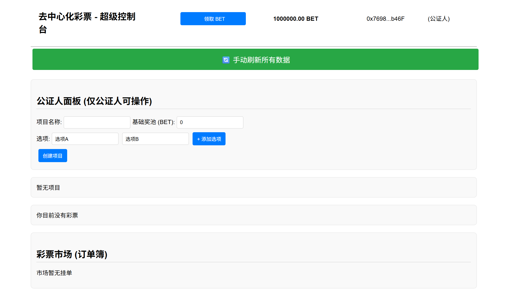
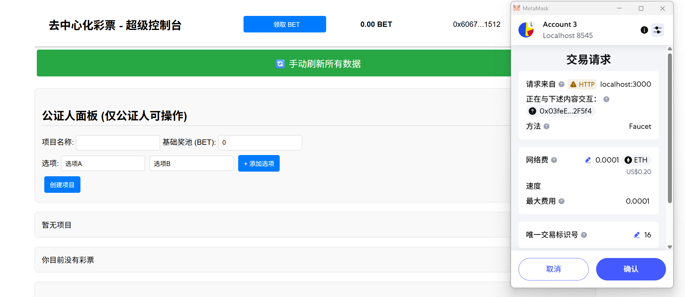
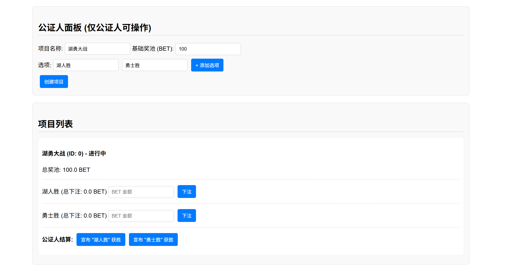
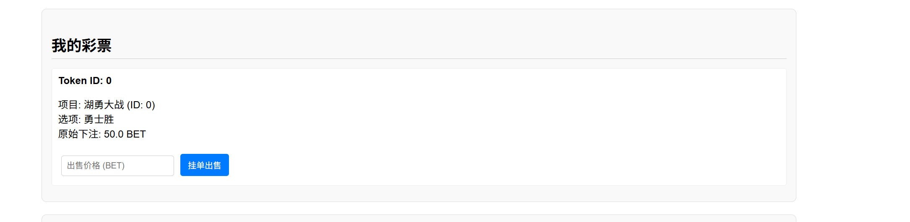
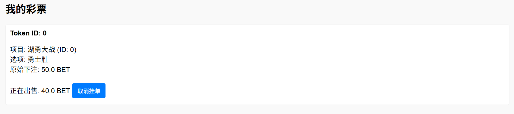
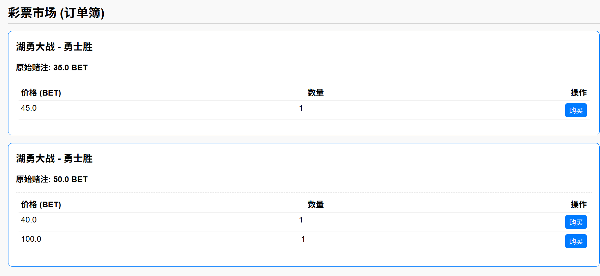
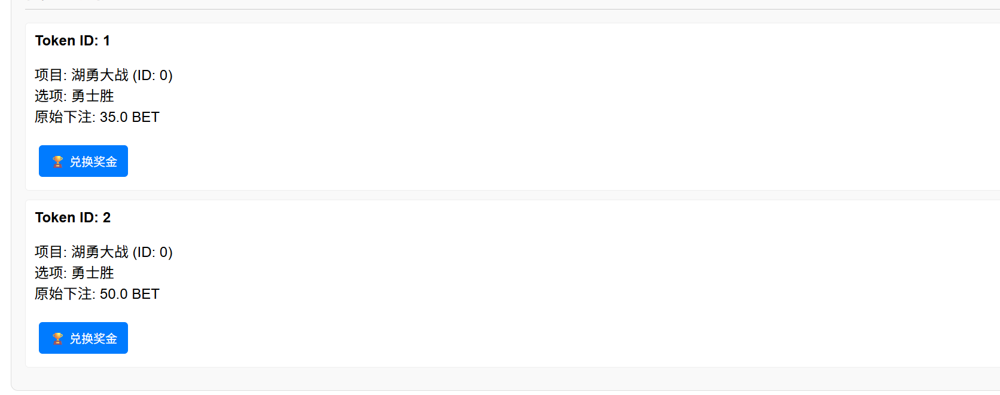

# 去中心化的彩票系统
## 如何运行
### 先决条件
* nodejs(18+)
* npm
* metamask
### 安装依赖
``` code
npm install
```
### 配置ganache
打开hardhat.config.ts文件，在url上写上你的测试端口，在accounts处填入你的账号
``` code
import { HardhatUserConfig } from "hardhat/config";
import "@nomicfoundation/hardhat-toolbox";

const config: HardhatUserConfig = {
  solidity: "0.8.20",
  networks: {
    ganache: {
      // rpc url, change it according to your ganache configuration
      url: 'HTTP://127.0.0.1:8545',
      // the private key of signers, change it according to your ganache user
      accounts: [
        '0x6feca58f7c3076baaee59275603ce82d92b144f332847f4a841fe1dfd2ab8f98',
        '0x4c6825b578ebc2035d3b4e432c9066866fcd4b90421669145a03159faa045011',  
        '0x30c41bd2a9435e0757e8b293e7947ae19cec0012ac962a4bbba642c88146097c',
        '0x87333b29f0cf1466e105e48d59e19d1cefd5915a8109ffa493a1c09365ef775f'      
      ]
    },
  },
};

export default config;

```
### 部署合约

```
npx hardhat compile
npx hardhat run scripts/deploy.ts --network ganache
```
将四个合约地址写入frontend/src/config.ts，将contracts/artifacts/contracts下的四个json文件放入frontend/src/artifacts下
### 启动前端
``` code
npm install
npm run start
```
## 功能实现分析
### 用户领取ERC20积分代币(bonus)
对于ERC20积分生态的构建，实现了给公证人发初始币，每个参与者可以领一笔币，尚未实现与eth货币的转换。
* 对于公证人，我们会送他1000000.00 BET  

* 对于普通的用户，可以在最初领取1000.00 BET 

### 发起项目
只允许公证人发起项目。可以设置项目名称，项目选项，初始赌池金额，以及最终的正确选项。

链上实现: 此操作由 DecentralizedLottery 合约的 createProject 函数处理。该函数被 onlyOracle (仅公证人) 修饰符保护。公证人提供的 oraclePoolAmount (BET 代币) 会被 transferFrom 到主合约地址，作为初始奖池
### 购买彩票
所有用户都可以购买彩票进行下注

链上实现: 当用户下注时，DecentralizedLottery 合约的 bet() 函数被调用。该函数会：
从用户处 transferFrom 所需的 BET (ERC20) 代币到合约奖池中。
调用 LotteryTicket.sol 合约，为用户铸造 (Mint) 一张唯一的 LotteryTicket (ERC721) NFT。
这张 NFT 的 tokenId 被用作独一无二的彩票凭证，其元数据（通过 ticketInfo 映射）在链上存储了 projectId, optionId 和 betAmount
### 二级市场(包含订单的bonus)
二级市场支持买卖的流通,并实现了订单薄
你可以自由选择出售的价格

订单薄会将相同项目相同选项相同投注的彩票，按照出售价格从低到高排列，然后你可以随意购买

本项目的实现方式是一个前端聚合的订单簿：
链上挂单: TicketMarketplace.sol 合约允许用户以指定价格挂单（listTicket）任意的 LotteryTicket NFT。
前端聚合: React 前端会获取所有挂单事件 (TicketListed)。
智能分组: 前端会查询每张挂单 NFT 的链上数据（项目, 选项, 投注额）。然后，它在本地将具有相同（项目+选项+投注额）的彩票进行聚合，并按价格（从低到高）排序，从而“虚拟地”创建出一个专业、易用的订单簿界面
### 开奖
只有公证人有权力开奖，公证人调用 resolveProject 函数，将项目的 winningOptionId 写入链上，并关闭项目
兑奖: 任何中奖的 NFT 持有者都可以调用 claimWinnings(tokenId)。合约会： a. 检查该 tokenId 对应的投注选项是否为 winningOptionId。 b. 计算总奖池 (totalPool = 公证人奖池 + 玩家总投注)。 c. 根据公式 payout = (betAmount * totalPool) / totalWinningBets 计算应得奖金。 d. 将 BET 代币转给赢家，并销毁 (burn) 该 NFT，防止重复兑奖

